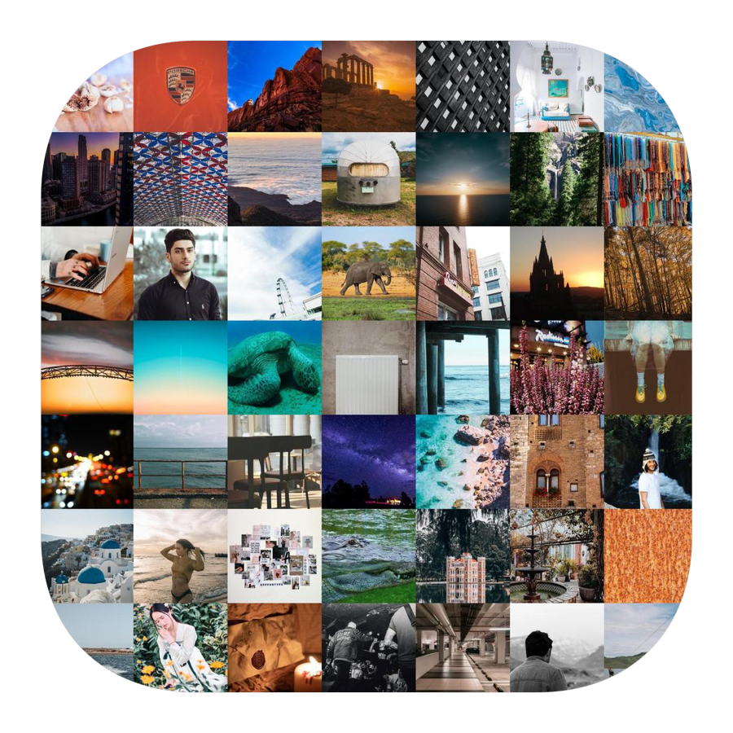
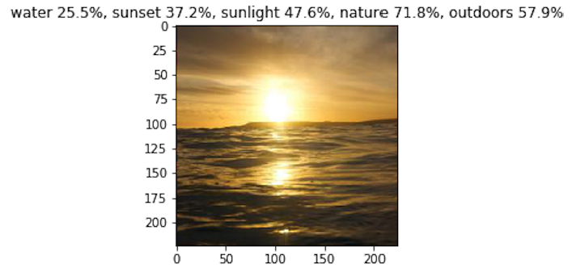
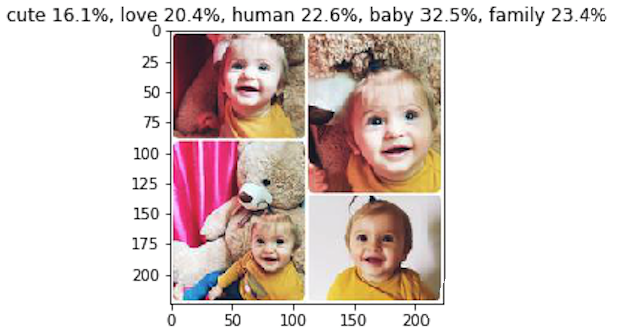
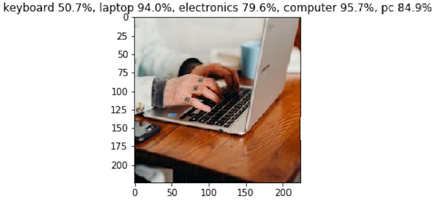
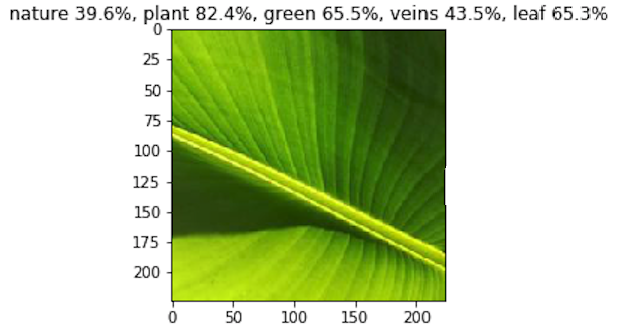
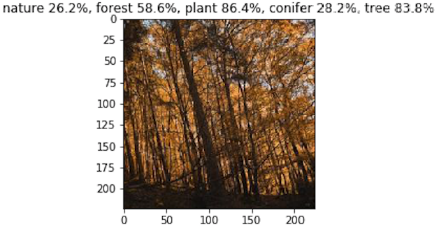
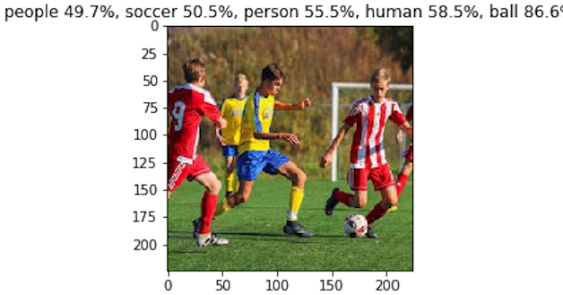
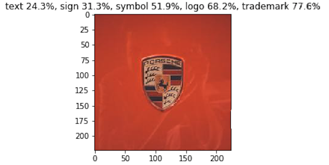

<h3 align="center">
  
</h3>

# Image Tagger

Python notebook containing keras multi-label image classifier. It can be used for labeling images with non-exclusive labels like hashtags.

## iOS

Check out the following iOS app that generates trending hashtags given image inputs.

## Dataset
Image Tagger was trained on the  [Various Tagged Images](https://www.kaggle.com/greg115/various-tagged-images) dataset. It contains **~0.7 M of 224x224px** crop-centered miscellaneous images of people, places, animals and objects collected from **instagram**, **unsplash** and **flickr**. 

## Results

